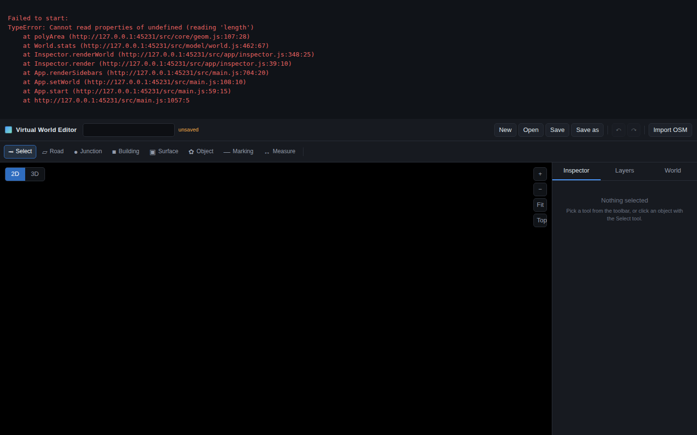

# virtual-world-editor

A browser-based 2D/3D virtual world editor and driving simulator. Plain JavaScript, no
external libraries, no build step — open `index.html` through a static server and it runs.



## Quick start

```bash
npm run dev          # python3 -m http.server 8080
# then open http://localhost:8080
```

A file:// URL will not work: the app is split into ES modules, so it needs HTTP.
`node tools/serve.mjs` starts an equivalent Node server if Python is unavailable.

## Features

**Editing**

- Eight tools: select, road, junction, building, surface, prop, marking, measure.
- Road drawing with class-based lane counts, angle snapping, auto-junction creation,
  and multi-segment chains committed as a single history entry.
- Marquee selection, shift-click toggling, alt-drag duplication, drag-move, and
  Delete/Backspace to remove.
- Layers with independent visibility, plus a layers panel showing per-layer counts.
- Inspector panel with live geometry editing; numeric fields derive dependent values
  (e.g. floors x floor height -> height) rather than storing stale numbers.
- Snapping engine for nodes, roads, edges, and grid.

**Simulation model**

- Lane graph built from the road network, with centre lines, left/right boundaries,
  predecessor/successor topology and turn classification.
- Routing between lanes, and an autonomy export format (`toAutonomyFormat`) carrying
  centrelines, boundaries, widths, speed limits in both m/s and kph, and junction nodes.
- Georeferencing via `unproject`, so a world can be anchored to real coordinates.

**Import / export**

- OpenStreetMap import (`src/app/osm.js`).
- JSON save/load, download, and localStorage autosave.

**Viewing**

- 2D renderer with layered draw order, theming, and sprites.
- 3D mode with orbit camera, extruded buildings, and screen-space picking.
- Minimap, scale bar, status bar, toasts, and a modal dialog system.

## Keyboard

| Key | Action |
| --- | --- |
| `V` `R` `J` `B` `G` `O` `M` `D` | Select, road, junction, building, surface, prop, marking, measure |
| `2` / `3` | Top-down 2D / 3D view |
| `F` | Fit world |
| `Tab` | Cycle active layer |
| `Ctrl/Cmd+Z`, `Ctrl/Cmd+Shift+Z`, `Ctrl/Cmd+Y` | Undo / redo |
| `Ctrl/Cmd+S` / `Ctrl/Cmd+O` | Save / open |
| `Ctrl/Cmd+D` | Duplicate selection |
| Arrow keys | Nudge selection (`Shift` for 5 m steps) |
| `Delete` / `Backspace` | Delete selection |
| `Escape` | Cancel the current draft |
| `Enter` | Commit the current road or surface draft |
| Wheel, middle- or right-drag, `Alt`-drag | Zoom, pan |

## Architecture

```
index.html          shell: topbar, toolbar, sidebar, statusbar, modal host
styles/app.css      all styling
src/
  main.js           app shell: input binding, picking, tool orchestration, render loop
  snap.js           snapping engine and screen-space tolerances
  core/             camera (2D + inertia), geometry, mat4, event emitter, history, utils
  model/            world data, schema/factories, lane network, geo, paint, demo world
  render/           2D renderer, 3D scene + renderer, orbit camera, sprites, theme
  app/              tools, inspector, minimap, OSM import, persistence, self-test
tools/              test harnesses (see Testing)
```

Data flows one way: tools mutate the world through a transaction, the world records
inverse operations onto a history stack, and the renderer draws whatever the world
currently holds. There is no framework and no virtual DOM; `src/app/dom.js` has small
helpers for the imperative panels.

## Testing

```bash
npm test              # smoke + functional + render3d
npm run test:smoke    # every module imports cleanly under a stubbed DOM
npm run test:functional  # builds a world, exercises the model pipeline
npm run test:render3d    # verifies 3D projection and picking math
node tools/browser.mjs   # full in-browser run (needs Chrome)
```

`tools/browser.mjs` boots the real page in headless Chrome, checks the console for
errors, takes a screenshot, decodes it via `tools/png.mjs`, and asserts on pixels
(the map is populated, the map centre is opaque, the sidebar renders separately from
the canvas). It also runs `src/app/selftest.js` in-page — 77 assertions covering
round-tripping, picking, each drawing tool, undo/redo, marquee selection, 3D
projection, and the autonomy export.

Chrome is located via `$CHROME_BIN`, falling back to `google-chrome`. The browser
suite is not part of `npm test` because it needs a browser binary; run it before
claiming a change is visually safe.

## Development update

The editor reached a working prototype. The last session was a stabilisation pass:
everything reported green, and the remaining work was fixing real bugs the tests
had been quietly tolerating.

### Bug fixes

- **Cascaded deletes were recorded twice in history.** `Transaction.remove` logged the
  dropped markings itself *and* `World._dropMarkingsForRoads` logged them through the
  world recorder. Undo therefore replayed each marking removal twice and the world
  came back with twice the markings it started with. The transaction now relies on
  the world's recorder so cascades are captured exactly once.
  (`src/core/history.js`)
- **Roads could never be picked in 2D.** `pickDistance` returned the whole result
  object from `distToSeg` instead of its `.d` field. The picker's finite-distance
  guard then rejected every road, so clicks fell through to the ground surface
  underneath. (`src/main.js`)
- **Ground surfaces could shadow anything above them.** Picking was a single
  min-distance pass across all types, so a surface at distance 0 beat a road at
  distance 1. Picking is now front-to-back in draw order, with nearest-wins inside
  each type. (`src/main.js`)
- **The measure tool swallowed left-button drags.** Left-drag was routed to panning
  whenever the measure tool was active, so a measurement could not be dragged out.
  (`src/main.js`)
- **Marquee selection never updated while dragging.** The pointermove handler only
  fed the marquee while the drag was still a possible click, so the rectangle froze
  at its first frame. It now updates in both the `maybe-move` and `marquee` states.
  (`src/app/tools.js`, `src/main.js`)
- **Building tool clicks fell through.** The building tool's on-click path called
  `clickBuilding` instead of `clickPolygon`, so the rectangle was never created from
  the two clicked corners. (`src/app/tools.js`)
- **Sidebar pixel checks always failed.** The screenshot histogram computed its
  right/bottom bounds from the box's width and height instead of adding them to its
  origin, so a right-hand region produced an empty histogram.
  (`tools/png.mjs`)

### Self-test corrections

Several assertions were wrong rather than the code, and were corrected to describe
actual intended behaviour: multi-segment road drawing commits a whole chain in one
history step, a building's rectangle is anchored at the first click, the autonomy
format calls its polyline `centerline`, the 3D camera needs to be pumped until it
settles before projecting, and `fitWorld` animates, so the self-test now settles the
camera before using screen coordinates. Out-of-bounds picks now reject `NaN`
distances instead of comparing against them.

### Test results

| Suite | Result |
| --- | --- |
| `tools/smoke.mjs` | 79 passed, 0 failed |
| `tools/functional.mjs` | 79 passed, 0 failed |
| `tools/render3d.mjs` | 34 passed, 0 failed |
| `tools/browser.mjs` | 92 passed, 0 failed (in-page self-test 77/77) |

### Known limitations

- `tools/browser.mjs` needs a Chrome binary and is therefore not wired into
  `npm test`.
- The browser suite is a single 1440x900 viewport; there is no coverage of small
  screens or touch input.
- OSM import is one-way; there is no export back to OSM.

## License

MIT. See `LICENSE`.
